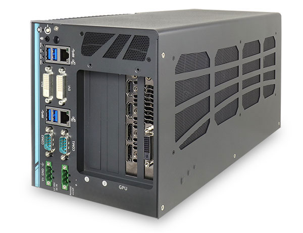
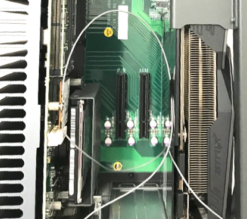

## Guide on Nuvo-6108GC Installation

```
Nuvo-6018GC is world's first industrial-grade GPU computer supporting high-end graphics cards. It's designed to fuel emerging GPU-accelerated applications, such as artificial intelligence, VR, autonomous driving and CUDA computing, by accommodating nVidia GPU with up to 250W TDP. Leveraging Intel® C236 chipset, Nuvo-6018GC supports Xeon® E3 V5 or 6th-Gen Core™ i7/i5 CPU with up to 32 GB ECC/ non-ECC DDR4 memory. It incorporates general computer I/Os such as Gigabit Ethernet, USB 3.0 and serial ports. In addition to the x16 PCIe port for GPU installation, Nuvo-6108GC further provides two x8 PCIe slots so you can have additional devices for information collection and communication.Nuvo-6108GC comes with sophisticated power design to handle heavy power consumption and power transient of a 250W GPU. Furthermore, to have reliable GPU performance for industrial environments, Nuvo-6018GC inherits Neousys' patented design, a tuned cold air intake to effectively dissipate the heat generated by GPU. This unique design guarantees operation at 60°C with 100% GPU loading and makes Nuvo-6018GC extremely reliable for demanding field usage.

----NEOUSYS MARKETING TEAM
```

### IPC Configuration

Configure the IPC as follows:

- ASUS GTX1080 GPU-A8G-Gaming GPU Card

- 32GB DDR4 RAM

- PO-280W-OW 280W AC/DC power adapter

- 2.5" SATA Hard Disk 1TB 7200rpm

  

### Preparing the IPC

Follow these steps:

1. Prepare and install the Controller Area Network (CAN) card: 	
   In the Neousys Nuvo-6108GC, ASUS® GTX-1080GPU-A8G-GAMING GPU card is pre-installed into one of the three PCI slots. We still need to install a CAN card into a PCI slot. 
   
    a. Locate and unscrew the eight screws (shown in the brown squares or	pointed by brown arrows) on the side of computer:
  
  
  
    b. Remove the cover from the IPC. 
    
  
    
    You will find 3 PCI slots (one occupied by the	graphic card) located on the base:

   

   c. [Optional] Set the CAN card termination jumper by removing the red jumper cap (shown in the diagram below) from its default location and placing it at its termination position:

   

   **WARNING**: The CAN card will not work if the termination jumper is not set correctly.

   d. [Optional] Insert the CAN card into the slot in the IPC:

   

    e. Reinstall the cover for the IPC

   

2. Power up the IPC:

   a. Attach the power cable to the power connector (terminal block) that comes with the IPC:

   **WARNING**: Make sure that the positive(labeled **R**  for red) and the negative(labeled **B** for black) wires of the power cable are inserted into the correct holes on the power terminal block as seen in the image below. 

   

   b. Connect the monitor, Ethernet cable, keyboard, and mouse to the IPC:

  


3. Start the computer:

It is recommended to configure the fan speed through BIOS settings, if one or more plugin card is added to the system

```
- While starting up the computer, press F2 to enter BIOS setup menu.
- Go to [Advanced] => [Smart Fan Setting]
- Set [Fan Max. Trip Temp] to 50
- Set [Fan Start Trip Temp] to 20
```

It is recommended that you use a Digital Visual Interface (DVI) connector on the graphic card for the monitor. To set the display to the DVI port on the motherboard, following is the setting procedure:

```
- While starting up the computer, press F2 to enter BIOS setup menu.
- Go to [Advanced]=>[System Agent (SA) Configuration]=>[Graphics Configuration]=>[Primary Display]=> Set to "PEG"
```

It is recommended to configure the IPC to run at maximum performance mode at all time:

```
- While starting up the computer, press F2 to enter BIOS setup menu.
- Go to [Power] => [SKU POWER CONFIG] => set to "MAX. TDP"
```

4.  Connect the power: 


### References

1. Neousys Nuvo-6108GC [Product Page](http://www.neousys-tech.com/en/product/application/rugged-embedded/nuvo-6108gc-gpu-computing)

## Disclaimer

This device is `Apollo Platform Supported`