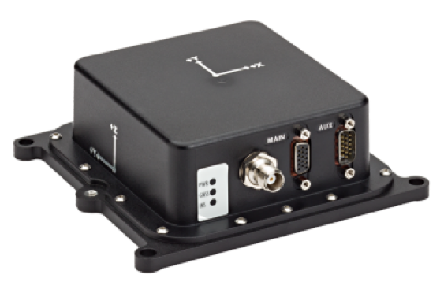

## Installation Guide of SPAN-IGM-A1

The NovAtel SPAN-IGM-A1 is an integrated, single-box solution that offers tightly coupled Global Navigation Satellite System (GNSS) positioning and inertial navigation featuring the NovAtel OEM615 receiver.



The GPS Receiver/Antenna used with the GPS-IMU component is the **NovAtel GPS-703-GGG-HV**.

```
The GPS NovAtelGPS-703-GGG-HV works with either model of the two GPS-IMU options (SPAN-IGM-A1 and Propak6), Global Positioning System (GPS) and Inertial Measurement Unit (IMU).
```


### Installing the GPS Receiver and Antenna

The installation instructions describe the procedure to mount, connect, and take the lever arm measurements for the GPS-IMU NovAtel SPAN-IGM-A1.

##### Mounting

You can place the GPS-IMU NovAtel SPAN-IGM-A1 in most places in the vehicle but it is suggested that you follow these recommendations:

- Place and secure the NovAtel SPAN-IGM-A1 inside the trunk with the Y-axis pointing forward.
- Mount the NovAtel GPS-703-GGG-HV antenna in an unobstructed location on top of the vehicle.

##### Wiring

There are three cables that need to be connected

- The antenna cable connects the GNSS antenna to the antenna port of the SPAN-IGM-A1
- The main cable:
  - Connect the 15-pin end to the SPAN-IGM-A1
  - Connect the power wires to a power supply of 10-to-30V DC
  - Connects the user port to the IPC. 
  - If the power comes from a vehicle battery, add an auxiliary battery (recommended).
- The AUX cable:
  - Connect the AUX cable to the 15-pin Aux port
  - Connect the USB cable to the IPC, if the USB port is used for data transferring.

Refer to the diagram below for reference:


For additional information, visit Page 3 of [the SPAN-IGM™ Quick Start Guide](http://www.novatel.com/assets/Documents/Manuals/GM-14915114.pdf) to view the detailed diagram.

##### Taking the Lever Arm Measurement

When the SPAN-IGM-A1 and the GPS Antenna are in position, the distance from the SPAN-IGM-A1 to the GPS Antenna must be measured. The distance should be measured as: X offset, Y offset, and Z offset.

The center of the IMU and the center of the antenna are labeled on the exterior of the devices.

For additional information, visit Page 5 of [the SPAN-IGM™ Quick Start Guide](http://www.novatel.com/assets/Documents/Manuals/GM-14915114.pdf) to view the detailed diagram.

### Configuring the GPS and IMU

Configure the SPAN-IGM-A1 as shown below. The setting can be configured by keying in the following command or loading a batch file in Novatel Connect:

```
WIFICONFIG STATE OFF
UNLOGALL THISPORT
INSCOMMAND ENABLE
SETIMUORIENTATION 5
ALIGNMENTMODE AUTOMATIC  
VEHICLEBODYROTATION 0 0 0
COM COM1 9600 N 8 1 N OFF OFF
COM COM2 9600 N 8 1 N OFF OFF
INTERFACEMODE COM1 NOVATEL NOVATEL ON
PPSCONTROL ENABLE POSITIVE 1.0 10000
MARKCONTROL MARK1 ENABLE POSITIVE
EVENTINCONTROL MARK1 ENABLE POSITIVE 0 2
interfacemode usb2 rtcmv3 none off
rtksource auto any
psrdiffsource auto any

SETIMUTOANTOFFSET 0.00 1.10866 1.14165 0.05 0.05 0.08
SETINSOFFSET 0 0 0
EVENTOUTCONTROL MARK2 ENABLE POSITIVE 999999990 10
EVENTOUTCONTROL MARK1 ENABLE POSITIVE 500000000 500000000


LOG COM2 GPRMC ONTIME 1.0 0.25
LOG USB1 GPGGA ONTIME 1.0

log USB1 bestgnssposb ontime 1
log USB1 bestgnssvelb ontime 1
log USB1 bestposb ontime 1
log USB1 INSPVAXB ontime 1
log USB1 INSPVASB ontime 0.01
log USB1 CORRIMUDATASB ontime 0.01
log USB1 RAWIMUSXB onnew 0 0
log USB1 mark1pvab onnew

log USB1 rangeb ontime 1
log USB1 bdsephemerisb
log USB1 gpsephemb
log USB1 gloephemerisb
log USB1 bdsephemerisb ontime 15
log USB1 gpsephemb ontime 15
log USB1 gloephemerisb ontime 15

log USB1 imutoantoffsetsb once
log USB1 vehiclebodyrotationb onchanged
 
SAVECONFIG
```

** WARNING:** Modify the **<u>SETIMUTOANTOFFSET</u>** line based on the actual measurement (of the antenna and the SPAN-IGM-A1 offset).

For example:

```
SETIMUTOANTOFFSET -0.05 0.5 0.8 0.05 0.05 0.08
```
The first 3 numbers indicate the result of the lever arm distance measurement. The last 3 numbers are the uncertainty of the measurement. 

### References

For additional information on the NovAtel SPAN-IGM-A1:

* [NovAtel SPAN-IGM-A1 Product Page](https://www.novatel.com/products/span-gnss-inertial-systems/span-combined-systems/span-igm-a1/)

* [NovAtel GPS-703-GGG-HV Product page](https://www.novatel.com/products/gnss-antennas/high-performance-gnss-antennas/gps-703-ggg-hv/)

*  [SPAN-IGM™ Quick Start Guide](http://www.novatel.com/assets/Documents/Manuals/GM-14915114.pdf)

* [SPAN-IGM™ User Manual](http://www.novatel.com/assets/Documents/Manuals/OM-20000141.pdf)

## Disclaimer

This device is `Apollo Platform Supported`
