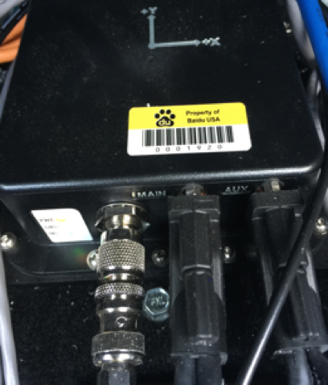

## SPAN-IGM-A1安装指南

NovAtel SPAN-IGM-A1是一个集成的单盒的并且紧密耦合了全球卫星导航系统和惯性导航系统，以NovAtel OEM615接收器为本身特点的方案。


和GPS-IMU一同使用的GPS接收器/天线是 **NovAtel GPS-703-GGG-HV**.

```
GPS NovAtelGPS-703-GGG-HV必须和两种GPS-IMU选择的任一模型(SPAN-IGM-A1 和 Propak6), 全球定位系统(GPS)和惯性计算单元(IMU)协同工作。
```


### 安装GPS接收器和天线

本安装指令描述了挂载、连接和为GPS-IMU NovAtel SPAN-IGM-A1量取和设置控制杆尺寸的步骤。

##### 挂载

使用者可以将装置GPS-IMU NovAtel SPAN-IGM-A1放置在车辆上的大部分位置，但是我们建议使用者采用下述的建议方案：

- 将GPS-IMU NovAtel SPAN-IGM-A1放置并固定在车辆内部，同时使Y轴指向前方。
- 将NovAtel GPS-703-GGG-HV 天线挂载在车辆上方无遮挡的区域。

##### 配线

有三个需要连接的数据线

- 天线数据线将GNSS天线连接到SPAN-IGM-A1天线端口
- 主数据线：
  - 将15-pin端连接到SPAN-IGM-A1
  - 连接电源线到一个10-to-30V DC电源
  - 连接用户端口到IPC.
  - 如果电源供应来自于车辆的电池，则需要额外增加一个辅助电池（推荐）。
- AUX线:
  - 连接AUX数据线到15-pin AUX端口
  - 如果USB端口用于数据传输，则连接USB数据线到IPC
请参考下述图片：



如果需要了解更多信息，请访问[the SPAN-IGM™ Quick Start Guide](http://www.novatel.com/assets/Documents/Manuals/GM-14915114.pdf)第3页获取更多详细的图片。

##### 量取控制臂长度

当SPAN-IGM-A1和GPS天线处在正确位置时量取SPAN-IGM-A1到GPS天线的距离。距离被测量并记录为X轴偏移、 Y轴偏移、 和Z轴偏移。设备的中点标记在设备的外部。

如果需要了解更多信息，请访问[the SPAN-IGM™ Quick Start Guide](http://www.novatel.com/assets/Documents/Manuals/GM-14915114.pdf)第5页获取更多详细的图片。

### 配置GPS和SPAN-IGM-A1

下面展现了配置GPS和SPAN-IGM-A1的方法。该配置过程可以通过键入命令或从NovAtel Connect下载批量配置文件完成。

```
WIFICONFIG STATE OFF
UNLOGALL THISPORT
INSCOMMAND ENABLE
SETIMUORIENTATION 5
ALIGNMENTMODE AUTOMATIC  
VEHICLEBODYROTATION 0 0 0
COM COM1 9600 N 8 1 N OFF OFF
COM COM2 9600 N 8 1 N OFF OFF
INTERFACEMODE COM1 NOVATEL NOVATEL ON
PPSCONTROL ENABLE POSITIVE 1.0 10000
MARKCONTROL MARK1 ENABLE POSITIVE
EVENTINCONTROL MARK1 ENABLE POSITIVE 0 2
interfacemode usb2 rtcmv3 none off
rtksource auto any
psrdiffsource auto any

SETIMUTOANTOFFSET 0.00 1.10866 1.14165 0.05 0.05 0.08
SETINSOFFSET 0 0 0
EVENTOUTCONTROL MARK2 ENABLE POSITIVE 999999990 10
EVENTOUTCONTROL MARK1 ENABLE POSITIVE 500000000 500000000


LOG COM2 GPRMC ONTIME 1.0 0.25
LOG USB1 GPGGA ONTIME 1.0

log USB1 bestgnssposb ontime 1
log USB1 bestgnssvelb ontime 1
log USB1 bestposb ontime 1
log USB1 INSPVAXB ontime 1
log USB1 INSPVASB ontime 0.01
log USB1 CORRIMUDATASB ontime 0.01
log USB1 RAWIMUSXB onnew 0 0
log USB1 mark1pvab onnew

log USB1 rangeb ontime 1
log USB1 bdsephemerisb
log USB1 gpsephemb
log USB1 gloephemerisb
log USB1 bdsephemerisb ontime 15
log USB1 gpsephemb ontime 15
log USB1 gloephemerisb ontime 15

log USB1 imutoantoffsetsb once
log USB1 vehiclebodyrotationb onchanged
 
SAVECONFIG
```

** WARNING：** 基于对 SPAN-IGM-A1和天线偏移值的实际测量数据修改 **<u>SETIMUTOANTOFFSE</u>T** 行对应的参数

例如：

```
SETIMUTOANTOFFSET -0.05 0.5 0.8 0.05 0.05 0.08
```
前3个数字表示控制杆的测距结果。后3个数字表示测量的不确定性（误差）。

### 资料参考

获取更多关于NovAtel SPAN-IGM-A1的信息，请参考：

* [NovAtel SPAN-IGM-A1 Product Page](https://www.novatel.com/products/span-gnss-inertial-systems/span-combined-systems/span-igm-a1/)

* [NovAtel GPS-703-GGG-HV Product page](https://www.novatel.com/products/gnss-antennas/high-performance-gnss-antennas/gps-703-ggg-hv/)

*  [SPAN-IGM™ Quick Start Guide](http://www.novatel.com/assets/Documents/Manuals/GM-14915114.pdf)

* [SPAN-IGM™ User Manual](http://www.novatel.com/assets/Documents/Manuals/OM-20000141.pdf)

## 免责声明

This device is `Apollo Platform Supported`
