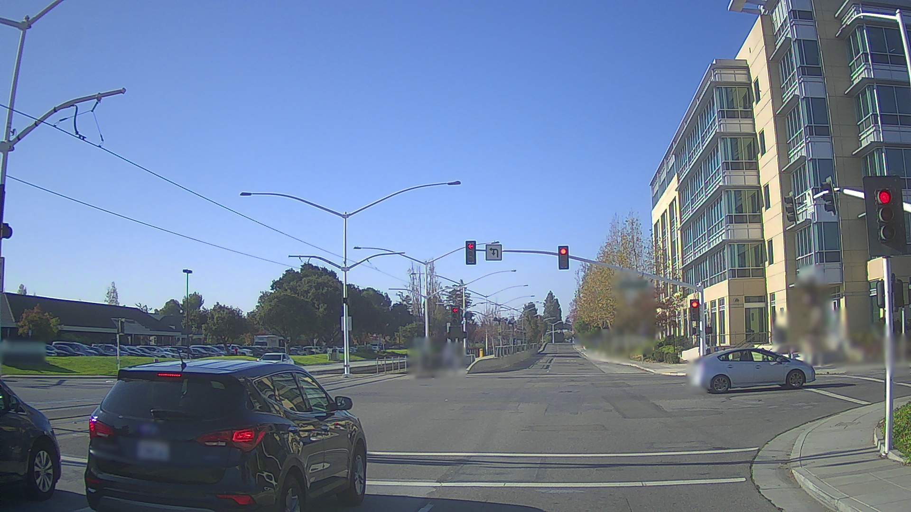

# 交通信号灯感知

本文档详细的介绍了Apollo2.0中交通信号感知模块的工作原理。

## 简介

交通信号灯感知模块通过使用摄像头提供精确全面的路面交通信号灯状态。

通常情况下，交通信号灯有3种状态：

- 红
- 黄
- 绿

然而当信号灯不能正常工作时，它可能是黑色的或者闪烁着红灯或黄灯。有时候在摄像头的视野内找不到信号灯，从而导致无法正确检测信号灯状态。

为了覆盖全部的情况，交通信号灯感知模块提供了5种信号灯状态输出：

- 红
- 黄
- 绿
- 黑
- 未知

该模块的高精地图功能反复的检测车辆前方是否有信号灯出现。在给定车辆的位置后，可以通过查询高精地图获取信号灯的边界，并用边界上的4个点来表示信号灯。如果存在信号灯，则信号灯位置信息将从世界坐标系投射到图片坐标系。

Apollo已经证明了仅仅使用一个固定视野的摄像头无法识别所有的信号灯。存在这种限制的原因是：

- 感知范围应该大于100米
- 信号灯的高度和路口的宽度变化范围很大

结果是Apollo2.0使用了2个摄像头来扩大感知范围。

-  一个**远距摄像头**，焦距是25毫米，被用来观察前方远距离的信号灯。远距摄像头捕获的信号灯在图片上展现的非常大而且容易被检测。但是远距摄像头的视野有限制，如果路线不够直或者车辆太过于靠近信号灯，经常无法拍摄到信号灯。


- 一个**广角摄像头**。焦距是6毫米，是对远距摄像头视野不足的补充。

该模块会根据当前信号灯的投射状态决定使用哪个摄像头。虽然只有两个摄像头，但是该模块的算法被设计的可以控制多个摄像头。

下述图片展示了使用远距摄像头（上图）和广角摄像头（下图）检测到信号灯的图片。





# 数据管道

数据管道有两个主要的部分，会在下面章节中介绍
- 预处理阶段
  - 信号灯投射
  - 摄像头选择
  - 图像和信号灯缓存同步
- 处理阶段
  - 调整—提供精确的信号灯边界盒
  - 识别—提供每个边界盒的颜色
  - 修正—根据时间顺序关系修正颜色

## 预处理阶段

没有必要在每一帧的图像中去检测信号灯。信号灯的变化频率是很低的而且计算机的资源也有限。通常，从不同摄像头输入的图像信息会几乎同时的到达，但是只有一个会进入管道的处理阶段。因此图像的遴选和匹配是很必要的。

### 输入输出

本章节介绍了预处理阶段的输入输出数据。输入数据可以通过订阅Apollo相关模块数据来获得，或者直接读取本地的存储文件。输出数据被传输到下一层的处理阶段。

#### 输入数据

- 可以通过订阅以下topic来获取不同摄像头的图像数据：

    - `/apollo/sensor/camera/traffic/image_long`
    - `/apollo/sensor/camera/traffic/image_short`

- 定位信息，通过查询以下topic获得：
    - `/tf`

- 高精地图

- 校准结果

#### 输出数据

  - 被选择的摄像头输出的的图像信息
  - 从世界坐标系投射到图像坐标系的信号灯边界盒
  
### 摄像头选择
  
使用一个唯一的ID和其边界上的4个点来表示信号灯，每个点都是世界坐标系中的3维坐标点。

下例展示了一个典型的信号灯记录信息`signal info`。给出车辆位置后，4个边界点可以通过查询高精地图获得。

```protobuf
signal info:
id {
  id: "xxx"
}
boundary {
  point { x: ...  y: ...  z: ...  }
  point { x: ...  y: ...  z: ...  }
  point { x: ...  y: ...  z: ...  }
  point { x: ...  y: ...  z: ...  }
}
```

3维世界坐标系中的边界点随后被投射到每个摄像头图像的2维坐标系。对每个信号灯而言，远距摄像头图像上展示的4个投射点区域更大，这比广角摄像头更容易检测信号灯。最后会选择具有最长的焦距且能够看到所有信号灯的摄像头图片作为输出图像。投射到该图像上的信号边界盒将作为输出的边界盒。

被选择的摄像头的ID和时间戳缓存在队列中：


 ``` C++
struct ImageLights {
  CarPose pose;
  CameraId camera_id;
  double timestamp;
  size_t num_signal;
  ... other ...
};
 ```
 
 至此，我们需要的所有信息包括定位信息、校准结果和高精地图。因为投射不依赖于图像的内容，所以选择可以在任何时间完成。在图像信息到达时进行选择仅仅是为了简单。而且，并不是图像信息一到达就要进行选择，通常会设置选择的时间间隔。
 
 
### 图像同步

图像信息包含了摄像头ID和时间戳。摄像头ID和时间戳的组合用来找到可能存在的缓存信息。如果能在缓存区找到和该图像的摄像头ID一样且时间戳相差很小的缓存信息，则该图像会被传输到处理阶段。所有不合适的缓存信息会被丢弃。

## 处理阶段

该阶段分为3个步骤，每个步骤重点执行一个任务：

- 调整 — 在ROI中检测信号灯边界盒
- 识别 — 鉴别边界盒的颜色
- 修正 — 根据信号灯颜色的时间顺序关系修正颜色

### 输入输出

本章节介绍处理阶段的输入和输出数据。输入数据从预处理阶段获得，输出数据作为鉴别信号灯的结果。

#### 输入数据

- 被选择的摄像头图像信息
- 一组边界盒信息

#### 输出数据

  - 一组带有颜色标签的边界盒信息


### 调整

被定位信息、校准信息和高精地图信息影响的投射点 ***不是完全可靠的*** 。通过投射的信号灯位置计算的一个大的兴趣区域（Region of Interest ROI）被用来确定信号灯精确的边界盒。

在下述图片中，蓝色的长方形表示被投射的信号灯的边界盒，实际上和信号灯的准确位置有一定的偏差。大的黄色长方形是ROI。


信号灯检测是一个常规的卷积神经网络检测任务，它接收带有ROI信息的图像作为输入数据，顺序输出边界盒。输出结果中的信号灯数量可能多于输入数据。

Apollo会根据输入信号灯的位置、形状及检测的评分选择合适的信号灯。如果CNN在ROI内找不到任何的信号灯，则输入数据中的信号灯将被标记为未知，且跳过剩下的两个步骤。

### 识别

信号灯识别是一个常规的卷积神经网络鉴别任务，它接收带有ROI信息的图像和一组边界盒信息作为输入数据。输出数据是一个`$4\times n$ vector`， 表示每个边界盒是黑色、红色、黄色和绿色的概率。
当且仅当概率足够大时，有最大概率的类别会被识别为信号灯的状态。否则信号灯状态被设置为未知，表示状态未确定。

### 修正

因为信号灯可能会闪烁或者被遮挡，并且识别阶段也 ***并不是*** 完美的，输出的信号灯状态可能不是真正的状态。修正信号灯状态是很有必要的。

如果修正器接收到一个确定的信号灯状态例如红色或者绿色，则修正器保存该状态并直接输出。如果接收到黑色或者未知，修正器会检测状态保存列表。如果信号灯状态已经确定持续了一段时间，那么将保存的状态输出。否则将黑色或者未知输出。

因为时间顺序关系的存在，黄色只会在绿色之后红色之前出现，所以为了安全的考虑，在绿色出现之前任何红色之后的黄色都会被设置为红色。
